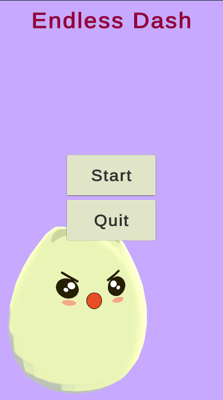
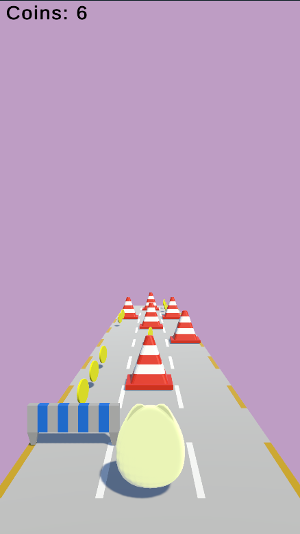
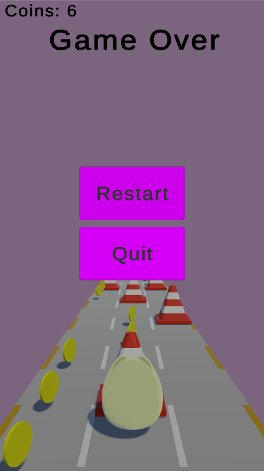

# 3D Runner (Unity)

Простая 3D игра в жанре раннера, созданная на Unity.

## Gameplay

## Features
- Управление персонажем
- Генерация препятствий
- Подсчёт очков
- UI интерфейс

## Tech
- Unity
- C#
- Visual Studio

## How to run
1. Открыть проект в Unity Hub
2. Запустить сцену Menu

## What I implemented
- Работа с 3D сценой
- Логика раннера
- Организация кода
